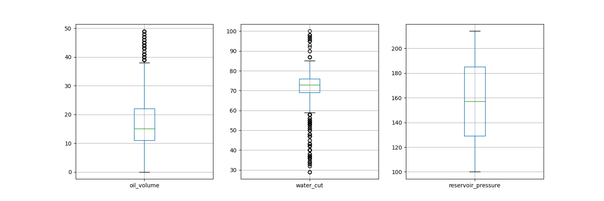

# oil-well-production-analysis
## Objective
Explore and understand the oil well production dataset in order to identify patterns,
data quality issues, and potential variables useful for predictive modeling.

## Dataset
Source: [Kaggle Oil Well Production Dataset](https://www.kaggle.com/datasets/ruslanzalevskikh/oil-well)

## Data Understanding

The dataset contains operational parameters from an oil well between 2013 and 2021, including oil production, liquid production, gas production, water cut, reservoir pressure, and other operational measurements.

Initial exploration was conducted to understand the structure of the dataset, the available variables, and potential data quality issues.

## Data Preprocessing

Raw operational data from the oil well was cleaned and standardized before analysis. Column names were normalized, dates were converted to datetime format, and the cleaned dataset was stored in the data/processed directory.

## Data Cleaning
### Handling missing dates
The time series contained a single missing daily observation (2015-05-31).
To ensure a consistent daily frequency, the dataset was reindexed using a daily time index and the missing observation was filled using linear interpolation.

Because only one value was missing in a dataset spanning several years, this approach preserves temporal continuity while introducing negligible distortion to the data.

### Outlier inspection
Boxplot analysis was performed to inspect the distribution of key variables.

Although some extreme values are present, they appear consistent with normal operational variability of the well rather than measurement errors. Therefore, no observations were removed at this stage.

### Data Cleaning Summary
Overall, the dataset required minimal cleaning. The main issue identified was a single missing date in the time series, which was handled by enforcing a daily frequency and filling the missing observation via linear interpolation.

Additional validation checks confirmed:
- No missing values across variables
- No duplicate timestamps
- Physical consistency between oil, water, and total liquid production
