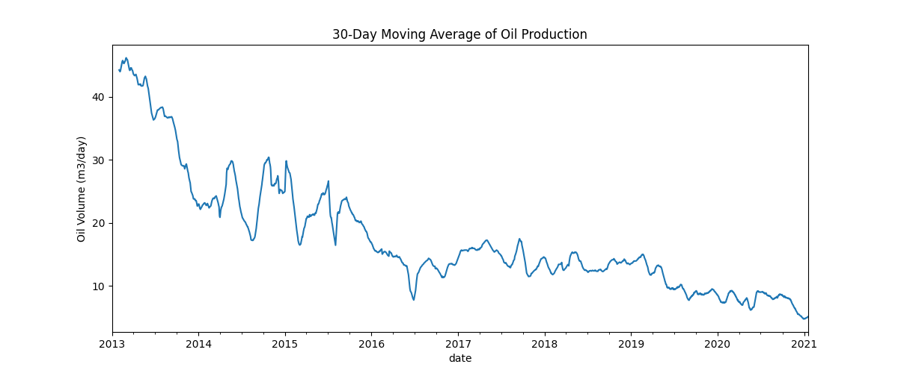
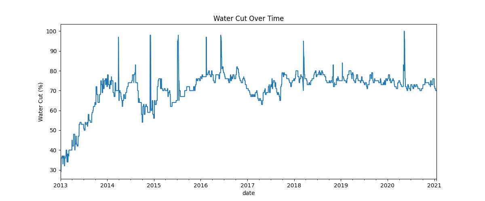
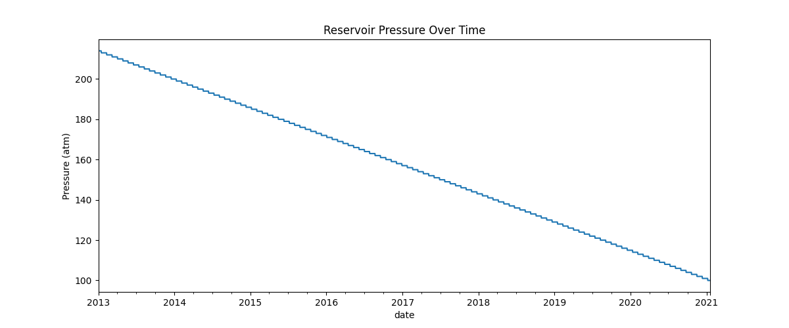
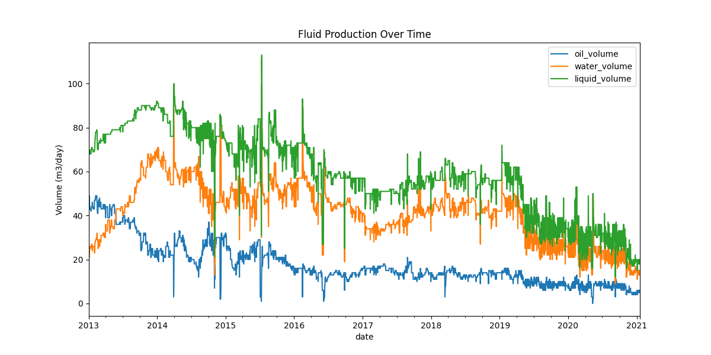
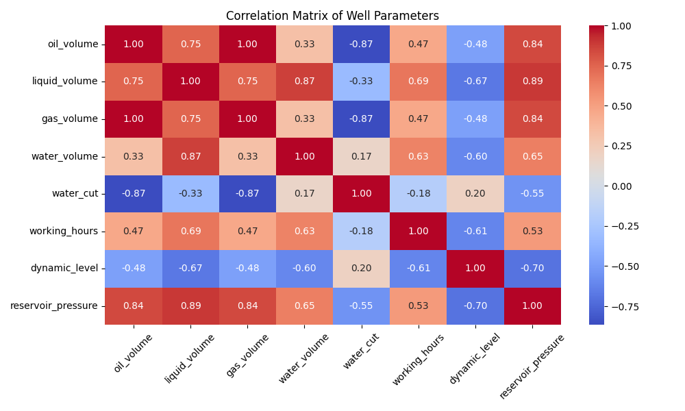
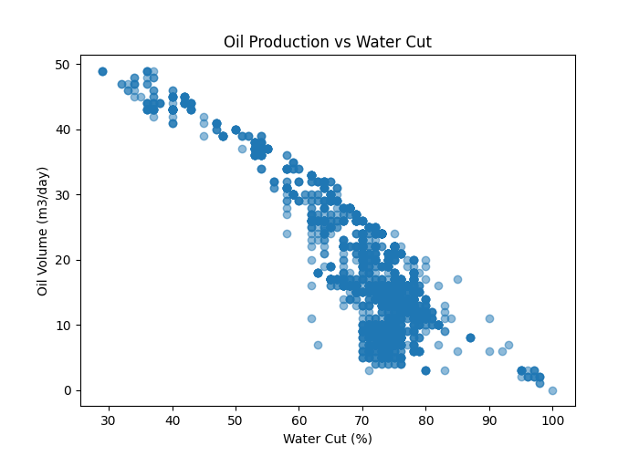
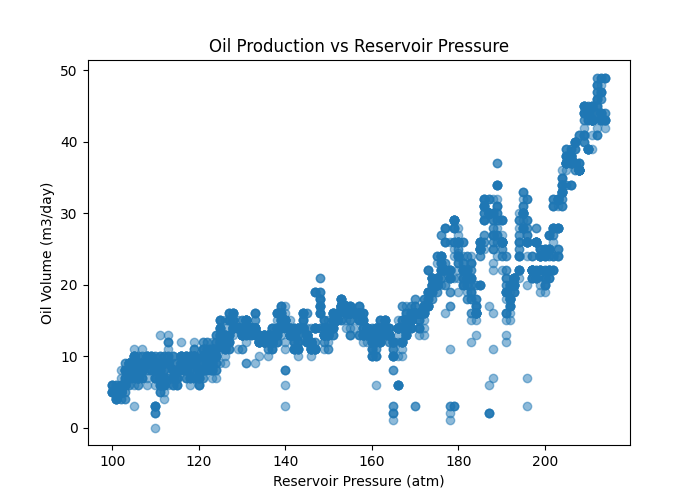
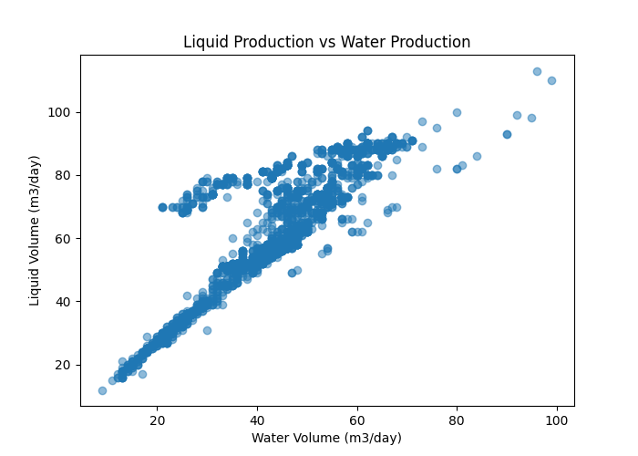

# oil-well-production-analysis
## Objective
Explore and understand the oil well production dataset in order to identify patterns,
data quality issues, and potential variables useful for predictive modeling.

## Dataset
Source: [Kaggle Oil Well Production Dataset](https://www.kaggle.com/datasets/ruslanzalevskikh/oil-well)

## Data Understanding

The dataset contains operational parameters from an oil well between 2013 and 2021, including oil production, liquid production, gas production, water cut, reservoir pressure, and other operational measurements.

Initial exploration was conducted to understand the structure of the dataset, the available variables, and potential data quality issues.

## Data Preprocessing

Raw operational data from the oil well was cleaned and standardized before analysis. Column names were normalized, dates were converted to datetime format, and the cleaned dataset was stored in the data/processed directory.

## Data Cleaning
### Handling missing dates
The time series contained a single missing daily observation (2015-05-31).
To ensure a consistent daily frequency, the dataset was reindexed using a daily time index and the missing observation was filled using linear interpolation.

Because only one value was missing in a dataset spanning several years, this approach preserves temporal continuity while introducing negligible distortion to the data.

### Outlier inspection
Boxplot analysis was performed to inspect the distribution of key variables.

Although some extreme values are present, they appear consistent with normal operational variability of the well rather than measurement errors. Therefore, no observations were removed at this stage.

### Data Cleaning Summary
Overall, the dataset required minimal cleaning. The main issue identified was a single missing date in the time series, which was handled by enforcing a daily frequency and filling the missing observation via linear interpolation.

Additional validation checks confirmed:
- No missing values across variables
- No duplicate timestamps
- Physical consistency between oil, water, and total liquid production

## Exploratory Data Analysis (EDA)

### Dataset Overview

The cleaned dataset contains **2,940 daily observations** of oil well operational data spanning from **January 2013 to January 2021**. The dataset includes the following variables:

* Oil production volume
* Total liquid production
* Gas production
* Water production
* Water cut (percentage of water in produced fluids)
* Working hours
* Dynamic fluid level
* Reservoir pressure

Initial descriptive statistics show that the well produces an average of **17.6 m³/day of oil**, with values ranging from **0 to 49 m³/day**. The average water cut is approximately **70%**, indicating that a significant fraction of produced fluids consists of water, which is common in mature oil wells.

---

### Temporal Behavior of Production

Time series visualization reveals a **clear decline in oil production over the analyzed period**. Production starts at relatively high levels in 2013 and gradually decreases toward 2021. This pattern is typical in oil reservoirs as the available hydrocarbons are progressively depleted.

At the same time, **water cut increases over time**, suggesting an increasing proportion of water in the produced fluids. This behavior is consistent with the phenomenon known as **water breakthrough**, where water from surrounding formations begins to dominate production as reservoir pressure declines.

Reservoir pressure also shows a **gradual downward trend**, which is characteristic of **reservoir depletion** as fluids are extracted from the formation.

---

### Fluid Production Dynamics

Analysis of fluid production shows that total liquid production is composed of both oil and water. Over time, the relative contribution of water increases while oil production declines.

This shift indicates that the well is transitioning toward a more **water-dominated production regime**, a typical stage in the lifecycle of mature oil fields.

---

### Correlation Analysis

A correlation analysis was performed to explore relationships between key operational variables.

The results reveal several meaningful relationships:

* **Oil production is negatively correlated with water cut**, indicating that higher water fractions are associated with lower oil output.

* **Oil production shows a positive relationship with reservoir pressure**, suggesting that higher reservoir pressure supports higher production rates.

* **Liquid production is strongly correlated with water production**, reflecting the increasing contribution of water to total produced fluids.

These relationships are physically consistent with expected reservoir behavior and provide useful insights for subsequent modeling and forecasting.

---

### Key Insights from EDA

The exploratory analysis highlights several important characteristics of the well:

* Oil production exhibits a **clear declining trend over time**.
* **Water cut increases steadily**, indicating growing water production.
* **Reservoir pressure decreases gradually**, suggesting reservoir depletion.
* Production dynamics reflect the behavior of a **mature oil well approaching late-stage production**.

